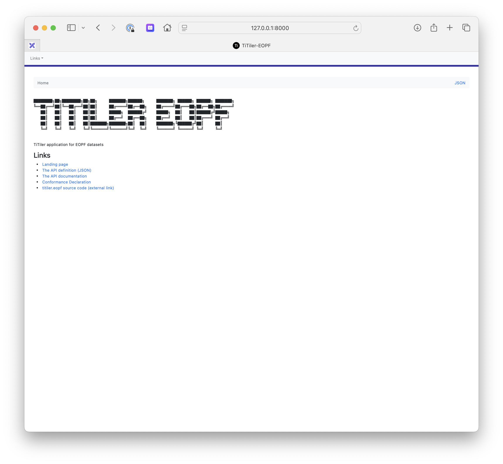

# titiler-eopf

<p align="center">
  
  <p align="center">TiTiler application for EOPF datasets</p>
</p>

<p align="center">
  <a href="https://github.com/EOPF-Explorer/titiler-eopf/actions?query=workflow%3ACI" target="_blank">
      
  </a>
  <a href="https://codecov.io/gh/EOPF-Explorer/titiler-eopf" target="_blank">
      
  </a>
  <a href="https://github.com/EOPF-Explorer/titiler-eopf/blob/main/LICENSE" target="_blank">
      
  </a>
</p>

---

**Documentation**:

**Source Code**: <a href="https://github.com/EOPF-Explorer/titiler-eopf/" target="_blank">https://github.com/EOPF-Explorer/titiler-eopf/</a>

---

## Installation

```bash
git clone https://github.com/EOPF-Explorer/titiler-eopf.git
cd titiler-eopf
python -m pip install -e .
```

## Configuration

Tiler's endpoints are configured to take `collection_id` and `item_id` path parameter in form of `/collections/{collection_id}/items/{item_id}/...`.

The Fastapi application will then construct a dataset full URL based on a datastore base url. The datastore url is configurable use env variable (or hardcoded in a `.env` file).

- `TITILER_EOPF_STORE_SCHEME`: Datastore scheme (e.g `s3`)
- `TITILER_EOPF_STORE_HOST`: Datastore host (e.g `my-bucket`)
- `TITILER_EOPF_STORE_PATH`: Datastore path (e.g `data`)

or

- `TITILER_EOPF_STORE_URL`: Datastore base url (e.g "s3://my-bucket/data/")

e.g:

`TITILER_EOPF_STORE_URL=s3://my-bucket/data/`

```
# Get Dataset Info for `s3://my-bucket/data/sentinel-2/S2A_MSIL2A_20250704T094051_N0511_R036_T33SWB_20250704T115824.zarr` file
http://127.0.0.1:8000/collections/sentinel-2/items/S2A_MSIL2A_20250704T094051_N0511_R036_T33SWB_20250704T115824/dataset
```

## Launch

```
python -m pip install uvicorn

TITILER_EOPF_STORE_URL=s3://my-bucket/data/ uvicorn titiler.eopf.main:app --port 8000
```

### Using Docker

```
git clone https://github.com/EOPF-Explorer/titiler-eopf.git
cd titiler-eopf

export AWS_ACCESS_KEY_ID=12345678910
export AWS_SECRET_ACCESS_KEY=a_super_secret_key
export AWS_DEFAULT_REGION=somewhere
export AWS_ENDPOINT_URL=https://custom_s3_endpoint.dev

export TITILER_EOPF_STORE_URL=s3://my-bucket/data/

docker-compose up --build api
```

`http://127.0.0.1:8000/api.html`


## Contribution & Development

See [CONTRIBUTING.md](https://github.com/EOPF-Explorer/titiler-eopf/blob/main/CONTRIBUTING.md)

## License

See [LICENSE](https://github.com/EOPF-Explorer/titiler-eopf/blob/main/LICENSE)

## Authors

See [contributors](https://github.com/EOPF-Explorer/titiler-eopf/graphs/contributors) for a listing of individual contributors.

## Changes

See [CHANGES.md](https://github.com/EOPF-Explorer/titiler-eopf//blob/main/CHANGES.md).


