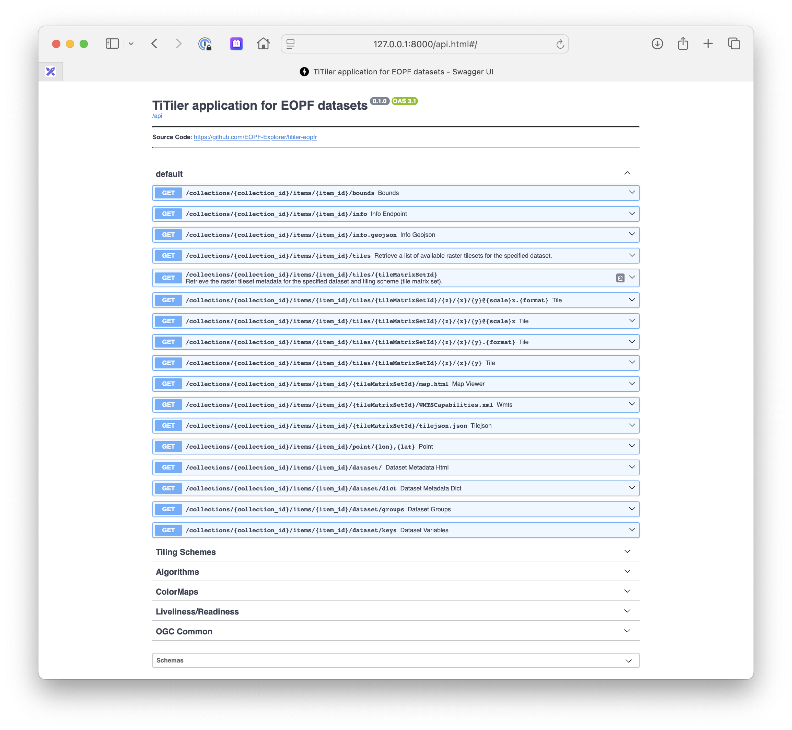

# titiler-eopf

<p align="center">
  
  <p align="center">TiTiler application for EOPF datasets</p>
</p>

<p align="center">
  <a href="https://github.com/EOPF-Explorer/titiler-eopf/actions?query=workflow%3ACI" target="_blank">
      
  </a>
  <a href="https://codecov.io/gh/EOPF-Explorer/titiler-eopf" target="_blank">
      
  </a>
  <a href="https://github.com/EOPF-Explorer/titiler-eopf/blob/main/LICENSE" target="_blank">
      
  </a>
</p>

---

**Documentation**:

**Source Code**: <a href="https://github.com/EOPF-Explorer/titiler-eopf/" target="_blank">https://github.com/EOPF-Explorer/titiler-eopf/</a>

---

## Installation

We recommand using [`uv`](https://docs.astral.sh/uv) as project manager for development.

See https://docs.astral.sh/uv/getting-started/installation/ for installation 

```bash
git clone https://github.com/EOPF-Explorer/titiler-eopf.git
cd titiler-eopf
uv sync
```

## Configuration

Tiler's endpoints are configured to take `collection_id` and `item_id` path parameter in form of `/collections/{collection_id}/items/{item_id}/...`.

The Fastapi application will then construct a dataset full URL based on a datastore base url. The datastore url is configurable use env variable (or hardcoded in a `.env` file).

- `TITILER_EOPF_STORE_SCHEME`: Datastore scheme (e.g `s3`)
- `TITILER_EOPF_STORE_HOST`: Datastore host (e.g `my-bucket`)
- `TITILER_EOPF_STORE_PATH`: Datastore path (e.g `data`)

or

- `TITILER_EOPF_STORE_URL`: Datastore base url (e.g "s3://my-bucket/data/")

e.g:

`TITILER_EOPF_STORE_URL=s3://my-bucket/data/`

```
# Get Dataset Info for `s3://my-bucket/data/sentinel-2/S2A_MSIL2A_20250704T094051_N0511_R036_T33SWB_20250704T115824.zarr` file
http://127.0.0.1:8000/collections/sentinel-2/items/S2A_MSIL2A_20250704T094051_N0511_R036_T33SWB_20250704T115824/dataset
```

## Launch

```
export TITILER_EOPF_STORE_URL=s3://my-bucket/data/ 
uv run --group server uvicorn titiler.eopf.main:app --host 127.0.0.1 --port 8080
```

### Using Docker

```
git clone https://github.com/EOPF-Explorer/titiler-eopf.git
cd titiler-eopf

export AWS_ACCESS_KEY_ID=12345678910
export AWS_SECRET_ACCESS_KEY=a_super_secret_key
export AWS_DEFAULT_REGION=somewhere
export AWS_ENDPOINT_URL=https://custom_s3_endpoint.dev

export TITILER_EOPF_STORE_URL=s3://my-bucket/data/

docker-compose up --build api
```

`http://127.0.0.1:8000/api.html`



## OpenEO API Deployment

This repository includes a second application that deploys an OpenEO API (`titiler.eopf.openeo.main:app`). The same Docker image built by the CI pipeline can be used to deploy either the TiTiler EOPF application or the OpenEO API by configuring the `MODULE_NAME` environment variable.

### Deploying with Upstream TiTiler-OpenEO Helm Chart

The OpenEO API can be deployed using the upstream TiTiler-OpenEO Helm chart from the [sentinel-hub/titiler-openeo](https://github.com/sentinel-hub/titiler-openeo) repository with the Docker image from this repository.

#### Prerequisites

- Kubernetes cluster with Helm 3.0+
- Docker image from this repository's CI: `ghcr.io/eopf-explorer/titiler-eopf`
- Access to the upstream helm chart: https://github.com/sentinel-hub/titiler-openeo/tree/main/deployment/k8s/charts

#### Configuration

Create a custom `values.yaml` file to override the upstream chart's default image and configure the OpenEO backend:

```yaml
# Image configuration - use the image from this repository's CI
image:
  repository: ghcr.io/eopf-explorer/titiler-eopf
  tag: latest  # or specific version tag (e.g., v1.0.0) or sha-<commit>
  pullPolicy: IfNotPresent

# IMPORTANT: Override the command to use uvicorn instead of gunicorn
# The upstream titiler-openeo chart expects uvicorn, but this image uses gunicorn by default
# You must override the command in the deployment configuration
command:
  - "uvicorn"
  - "titiler.eopf.openeo.main:app"
  - "--host"
  - "0.0.0.0"
  - "--port"
  - "80"

# Alternatively, if the chart doesn't support command override, you can use environment variables
# to configure gunicorn (though uvicorn is preferred for compatibility):
env:
  # Application module configuration (for gunicorn - only if you can't override the command)
  MODULE_NAME: titiler.eopf.openeo.main
  VARIABLE_NAME: app
  HOST: 0.0.0.0
  PORT: 80
  WEB_CONCURRENCY: 1
  
  # OpenEO Backend Configuration (Required)
  TITILER_OPENEO_STAC_API_URL: "https://api.explorer.eopf.copernicus.eu/stac/"
  TITILER_OPENEO_SERVICE_STORE_URL: "services/eopf-explorer.json"
  
  # Data Store Configuration
  TITILER_EOPF_STORE_URL: "s3://your-bucket/data/"
  
  # AWS Configuration (if using S3)
  AWS_DEFAULT_REGION: "de"
  AWS_ENDPOINT_URL: "https://s3.de.io.cloud.ovh.net/"
  AWS_EC2_METADATA_DISABLED: "true"
  
  # OpenEO Authentication Configuration (Optional)
  TITILER_OPENEO_AUTH_METHOD: "oidc"
  TITILER_OPENEO_AUTH_OIDC_CLIENT_ID: "cdse-public"
  TITILER_OPENEO_AUTH_OIDC_WK_URL: "https://identity.dataspace.copernicus.eu/auth/realms/CDSE/.well-known/openid-configuration"
  TITILER_OPENEO_AUTH_OIDC_REDIRECT_URL: "https://your-openeo-deployment-url/"
  TITILER_OPENEO_AUTH_OIDC_SCOPES: "openid profile email"
  TITILER_OPENEO_AUTH_OIDC_NAME_CLAIM: "preferred_username"
  
  # Additional OpenEO Configuration (Optional)
  TITILER_OPENEO_API_DEBUG: "false"
  TITILER_OPENEO_PROCESSING_MAX_ITEMS: "100"
  LOG_LEVEL: "INFO"

# AWS Credentials - reference to existing secret
# (The upstream chart may have different secret handling - adjust as needed)
secrets:
  aws:
    accessKeyId: "your-access-key-id"
    secretAccessKey: "your-secret-access-key"
```

#### Installation

1. **Clone the upstream TiTiler-OpenEO repository to access the Helm chart**:

```bash
git clone https://github.com/sentinel-hub/titiler-openeo.git
cd titiler-openeo/deployment/k8s/charts
```

2. **Create a Kubernetes secret for AWS credentials** (if using S3):

```bash
kubectl create secret generic openeo-aws-credentials \
  --from-literal=AWS_ACCESS_KEY_ID=your-access-key-id \
  --from-literal=AWS_SECRET_ACCESS_KEY=your-secret-access-key
```

3. **Install the chart with custom values**:

```bash
helm install openeo-eopf . -f /path/to/your/values.yaml
```

Or install directly from the cloned repository:

```bash
cd /path/to/titiler-openeo/deployment/k8s/charts
helm install openeo-eopf . -f values.yaml
```

#### Local Development

For local development, you can run the OpenEO API using the configuration from `.vscode/launch.json`:

```bash
export TITILER_OPENEO_STAC_API_URL="https://your-stac-api-url.com"
export TITILER_OPENEO_SERVICE_STORE_URL="services/eopf-explorer.json"
export TITILER_EOPF_STORE_URL="s3://your-bucket/data/"
export AWS_DEFAULT_REGION="your-region"
export AWS_ENDPOINT_URL="https://your-s3-endpoint.com/"

uv run --group server uvicorn titiler.eopf.openeo.main:app --host 127.0.0.1 --port 8081
```

#### Required Environment Variables

The OpenEO API requires the following environment variables to be configured:

- `TITILER_OPENEO_STAC_API_URL`: URL of the STAC API for collection discovery
- `TITILER_OPENEO_SERVICE_STORE_URL`: Path to the services configuration file
- `TITILER_EOPF_STORE_URL`: Base URL for the data store (supports s3://, file://, etc.)

Additional environment variables for authentication, AWS configuration, and other settings can be found in the `.vscode/launch.json` file.

## Contribution & Development

See [CONTRIBUTING.md](https://github.com/EOPF-Explorer/titiler-eopf/blob/main/CONTRIBUTING.md)

## License

See [LICENSE](https://github.com/EOPF-Explorer/titiler-eopf/blob/main/LICENSE)

## Authors

See [contributors](https://github.com/EOPF-Explorer/titiler-eopf/graphs/contributors) for a listing of individual contributors.

## Changes

See [CHANGES.md](https://github.com/EOPF-Explorer/titiler-eopf//blob/main/CHANGES.md).
